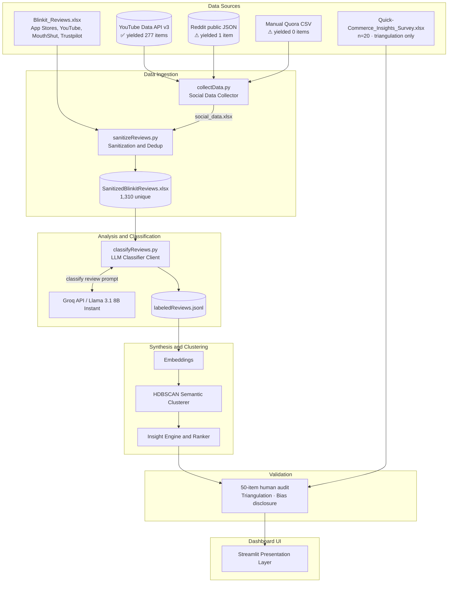
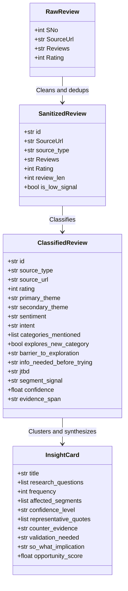
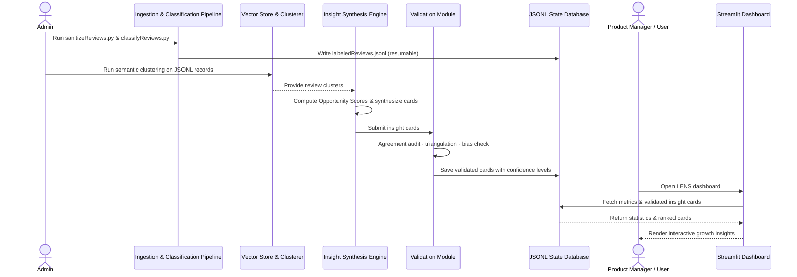

# Architecture: LENS (Listening ENgine for Shoppers) — AI-Powered Category-Discovery Insight Engine

This document describes the technical architecture for the Blinkit category-discovery insight engine. It is derived from [docs/context.md](./context.md) and defines components, data flows, interfaces, and implementation guidance for the build.

> **Documentation rule:** every figure in this file must be regenerable from a committed script's output (`sanitize_report.txt`, `themeSummary.csv`, the audit sheet). Any number that cannot be reproduced is removed rather than estimated. Illustrative examples are explicitly labelled as such.

---

## Table of Contents
1. [Goals and Constraints](#goals-and-constraints)
2. [Build Status](#build-status)
3. [High-Level Architecture](#high-level-architecture)
4. [Logical Layers](#logical-layers)
5. [Component Design](#component-design)
6. [Data Architecture](#data-architecture)
7. [Request Lifecycle](#request-lifecycle)
8. [LLM Integration Architecture](#llm-integration-architecture)
9. [API Design](#api-design)
10. [Presentation Layer](#presentation-layer)
11. [Cross-Cutting Concerns](#cross-cutting-concerns)
12. [Repository Structure](#repository-structure)
13. [Technology Options](#technology-options)
14. [Deployment Topology](#deployment-topology)
15. [Non-Functional Requirements](#non-functional-requirements)
16. [Future Extensions](#future-extensions)

---

## Goals and Constraints

### Primary Goals

| Goal | Description |
| :--- | :--- |
| **Classification & Tagging** | Classify reviews against the fixed taxonomy (10 substantive codes + `other`), identifying user segments and category-adoption barriers. |
| **Insight Explainability** | Every insight card carries direct evidence quotes and a "so-what" implication for increasing category exploration. |
| **Grounding (Anti-Hallucination)** | Every insight links back to real reviews via an exact-substring `evidence_span` and a source URL. |
| **Usability** | Prioritized, segment-aware insight dashboard that directly answers the 8 core research questions. |

### Architectural Constraints
* **Deduplicate before analyze**: Deduplicate raw review data before classification to cut LLM call volume, cost, and latency. **Actual measured effect on the current corpus: 1,327 rows → 1,310 unique (17 duplicates removed).** See [Corpus Facts](#corpus-facts) — do not cite a "~74%" duplication rate, which came from an earlier, different export.
* **Bounded context schema**: Classify every item against a fixed taxonomy to keep analysis structured and comparable. New top-level themes only via the `other` → ≥15× promotion rule.
* **Hinglish handling — in-prompt interpretation, not translation**: There is **no separate translation stage**. The classifier system prompt instructs the model to interpret Hinglish directly. Architecture and code must agree on this.
* **Resumable pipeline state**: Long-running classification resumes from `labeledReviews.jsonl` without reprocessing completed IDs.
* **Quarantine the loud majority**: `delivery_ops` dominates by volume but is low-addressability for category adoption. Ranking, not raw frequency, determines what surfaces.

### Out of Scope (Initial Milestone)
* Real-time streaming ingestion (live App Store RSS feeds).
* Automated ticket generation or support workflows — the focus is growth insight discovery.
* Custom fine-tuned models (use hosted OpenAI-compatible APIs such as Groq).
* **Solutioning.** LENS discovers and validates barriers; the MVP addresses them in Part 4.

---

## Build Status

| Component | Status | Artifact |
| :--- | :--- | :--- |
| Social Data Collector | ✅ Built (partial yield — see §Component Design) | `collectData.py` |
| Ingestion & Sanitization | ✅ Built | `sanitizeReviews.py` → `SanitizedBlinkitReviews.xlsx`, `sanitize_report.txt` |
| LLM Classifier | ✅ Built | `classifyReviews.py` → `labeledReviews.jsonl`, `themeSummary.csv` |
| Embedding & Clustering | 🔲 Planned | `src/clustering.py` |
| Insight Engine & Ranking | 🔲 Planned | `src/synthesis.py` → `insights.json` |
| Validation Module | 🔲 Planned | `src/validate.py` → audit sheet |
| Streamlit Dashboard | 🔲 Planned | `src/dashboard.py` (the graded public link) |

---

## Corpus Facts

`SanitizedBlinkitReviews.xlsx` — **1,310 unique reviews**, 5 sources:

| Source | Count |
| :--- | ---: |
| Google Play Store | 500 |
| Apple App Store | 487 |
| YouTube comments | 277 |
| MouthShut | 41 |
| Trustpilot | 4 |
| Reddit | 1 |

**Sanitization actuals:** 1,327 rows in → 17 duplicates removed → **1,310 unique**; 55 low-signal rows flagged (`is_low_signal=True`, retained not deleted); 1,255 usable rich reviews.

**Supporting dataset:** `Quick-Commerce_Insights_Survey.xlsx` (n=20) — used for **triangulation only**, never passed through the classifier.

**Corpus biases (must be surfaced in the dashboard and any deck):**
1. Rating polarization — 777 five-star vs 178 one-star, thin middle (32/31/15 for 3/4/2-star).
2. Source skew — 987 of 1,310 (75%) are app-store reviews, over-indexing delivery/refund complaints.
3. Missing ratings — the 277 YouTube items carry no star rating; rating-based analysis covers only 1,033 items.
4. Survivorship — only active users leave feedback.
5. Social thinness — Reddit (1) and Trustpilot (4) cannot support standalone claims.

---

## High-Level Architecture

Batch processing plus interactive synthesis: ingest → sanitize/dedup → classify → cluster semantically → synthesize ranked insight cards → render on a Streamlit dashboard.



### Architecture Style

| Aspect | Choice | Rationale |
| :--- | :--- | :--- |
| **Style** | Batch pipeline + interactive orchestrator | Heavy classification runs offline; synthesis and display stay fast. |
| **Coupling** | Decoupled scripts sharing JSONL state | Simple to debug, dry-run, and resume intermediate stages. |
| **State** | Persistent file-based storage | JSONL/Excel eliminates database hosting overhead for an MVP. |
| **Sync vs Async** | Asynchronous batch runs; synchronous rendering | Dashboard never blocks on LLM classification. |

---

## Logical Layers

```
┌────────────────────────────────────────────────────────────────────────────┐
│                        PRESENTATION LAYER (Streamlit)                      │
│   Insight cards · Research Q&A views · Filter widgets · Segment splits      │
└────────────────────────────────────────────────────────────────────────────┘
                                      │
                                      ▼
┌────────────────────────────────────────────────────────────────────────────┐
│                        VALIDATION LAYER                                    │
│   Human agreement audit · Triangulation · Confidence · Bias disclosure      │
└────────────────────────────────────────────────────────────────────────────┘
                                      │
                                      ▼
┌────────────────────────────────────────────────────────────────────────────┐
│                        INSIGHT SYNTHESIS LAYER                             │
│   Opportunity Score ranker · Cluster-level summarization · Quote mapping    │
└────────────────────────────────────────────────────────────────────────────┘
                                      │
                                      ▼
┌────────────────────────────────────────────────────────────────────────────┐
│                        CLUSTERING & EMBEDDING LAYER                        │
│   SentenceTransformers · HDBSCAN clustering · Cluster–label convergence     │
└────────────────────────────────────────────────────────────────────────────┘
                                      │
                                      ▼
┌────────────────────────────────────────────────────────────────────────────┐
│                        LLM CLASSIFICATION / API LAYER                      │
│   Groq Client · Llama 3.1 8B · Schema validation · Hinglish interpretation  │
└────────────────────────────────────────────────────────────────────────────┘
                                      │
                                      ▼
┌────────────────────────────────────────────────────────────────────────────┐
│                        DATA INGESTION & REPOSITORY LAYER                   │
│   Excel Sanitizer · Dedup Service · JSONL Reader/Writer · Social Collector  │
└────────────────────────────────────────────────────────────────────────────┘
```

---

## Component Design

### 1. Social Data Collector (`collectData.py`) — ✅ Built, partial yield
* **Responsibility**: Collect public conversation about quick commerce to diversify the corpus beyond app-store delivery complaints.
* **Sub-components and actual outcomes**:
  * `YouTubeScraper` — YouTube Data API v3, comment threads from review/haul videos. **✅ Yielded 277 items**, now merged into the corpus.
  * `RedditScraper` — public `.json` endpoints across `r/india`, `r/bangalore`, and similar. **⚠ Yielded 1 item.** Retained in code for reproducibility, but Reddit is **not** a working source for this corpus.
  * `QuoraLoader` — manual CSV import (Quora blocks automation). **⚠ Not used; 0 items.**
* **Architectural consequence**: the corpus is app-store dominant. This is a stated limitation, not a solved problem, and it is the reason the survey and primary interviews carry the discovery-signal load.

### 2. Ingestion & Sanitization Pipeline (`sanitizeReviews.py`) — ✅ Built
* **Responsibility**: Merge review sources, normalize text, deduplicate, classify source type, flag low-signal rows, assign stable IDs, and emit an auditable report.
* **Actual logic (matches code):**
  * Collapse whitespace and newlines; strip stray and smart quotes.
  * Drop blank rows.
  * Drop exact duplicate `Reviews` text (**17 removed from 1,327**).
  * Derive `source_type` from the URL.
  * Flag `is_low_signal` where the text has fewer than 10 latin/devanagari letters (**55 rows**) — **flagged, not deleted**, so the classifier can route them to `other` and the audit can check them.
  * Assign stable IDs `R0001…R1310`.
  * Emit `sanitize_report.txt` (before/after counts, source breakdown, rating distribution).
* **Not implemented (do not claim):** emoji stripping, lowercasing, fuzzy/near-duplicate matching, language translation.

### 3. LLM Classifier (`classifyReviews.py`) — ✅ Built
* **Responsibility**: Iterate unique reviews, query the LLM for the full metadata schema, write records sequentially.
* **Key functions**:
  * `classify(text)` — system prompt, `temperature=0`, enforced JSON mode, retry with backoff.
  * `src_type(url)` — source classification from URL.
  * Live progress bar with rate, ETA, and a completion summary.
* **Model**: `llama-3.1-8b-instant`. **Originally specified as `llama-3.3-70b-versatile`; switched after sustained HTTP 429 rate-limit errors on the Groq free tier.** The 8B model is adequate for bounded schema classification but weaker on nuanced Hinglish and borderline theme boundaries — **this raises, not lowers, the importance of the human-agreement audit.** Always report the model name alongside the agreement score.
* **Rate-limit posture**: `SLEEP = 4s` between calls to stay within free-tier limits; 429s trigger exponential backoff and are retried rather than recorded as classification failures.

### 4. Integration, Embedding & Clustering Service — 🔲 Planned
* Generate embeddings (e.g. `all-MiniLM-L6-v2`).
* Apply HDBSCAN to capture semantic micro-themes (e.g. "damaged packaging", "missing product specifications").
* **Cluster–label convergence check**: verify clusters against LLM primary themes. Agreement between two independent methods is convergent validity; a theme scattered across many clusters is flagged as fuzzy rather than reported as robust.

### 5. Insight Engine (Synthesis & Ranking) — 🔲 Planned
* **Synthesis prompt**: feed a cluster's representative quotes to the LLM to derive the finding, the adoption implication, affected segments, and any counter-evidence.
* **Opportunity Ranker**:
  $$\text{Opportunity} = \text{Frequency} \times \text{Severity} \times \text{Addressability} \times \text{Strategic Fit}$$
* **Why ranking rather than raw frequency**: `delivery_ops` will lead on volume but scores low on addressability and strategic fit for category adoption. Ranking is what allows an information/trust barrier to correctly outrank a delivery complaint.

### 6. Validation Module — 🔲 Planned (highest-scoring component)
1. **Human agreement** — hand-label 50 random reviews against the same taxonomy; report agreement % (target ≥85%) plus a confusion table identifying weak theme boundaries.
2. **Cluster–label convergence** — see §4.
3. **Source triangulation** — High confidence requires ≥2 source types; single-source insights are marked "directional."
4. **Confidence and assumption marking** — every insight High/Medium/Low; unproven leaps tagged `[ASSUMPTION]`; gaps tagged `[VALIDATE]` with a matching interview question.
5. **Bias disclosure** — the five biases in [Corpus Facts](#corpus-facts) are surfaced before insights, not buried in an appendix.

> ⚠️ **No agreement figure exists until the audit is run.** Do not hardcode a placeholder into any document, dashboard, or slide. A fabricated validation number is the most damaging possible error in a research deliverable.

---

## Data Architecture

### Canonical Data Models



### Theme Taxonomy — 10 substantive codes + 1 escape hatch

| # | Code | Definition | Answers |
|---|---|---|---|
| 1 | `habit_loop` | Repeats baskets, mission-driven ordering | Q1, Q4 |
| 2 | `awareness_gap` | Unaware the category exists on Blinkit | Q3 |
| 3 | `mental_model` | Narrow positioning ("emergency only") | Q2 |
| 4 | `trust_quality` | Freshness, wrong item, expiry, weight doubts | Q6 |
| 5 | `trust_information` | Demands ratings, details, specifications | Q5 |
| 6 | `price_value` | Fees, markups, missing coupons | Q6 |
| 7 | `ux_friction` | Search, navigation, cart, discovery UI | Q3, Q6 |
| 8 | `assortment_gap` | Out-of-stock, missing SKUs or categories | Q8 |
| 9 | `delivery_ops` | Speed, refunds, driver, support — **quarantined** | context |
| 10 | `emotional` | Anxiety, impulse, delight, FOMO | Q2 |
| — | `other` | Low-signal/emoji, or genuine signal outside the spine | — |

**Escape-hatch rule:** a recurring pattern within `other` is promoted to a real code only after ≥15 occurrences. This preserves inductive discovery without letting the model invent themes freely.

---

## Request Lifecycle



---

## LLM Integration Architecture

### Client Wrapper
```python
client = OpenAI(api_key=os.getenv("GROQ_API_KEY"), base_url="https://api.groq.com/openai/v1")
```
* **Classification engine**: `llama-3.1-8b-instant` — low latency, low cost, high free-tier limits.
* **Synthesis engine (planned)**: a higher-nuance model (e.g. `llama-3.3-70b-versatile`) for the far smaller number of cluster-synthesis calls, where judgment quality matters more than throughput.

### Prompting Strategy
* **Structured output**: JSON mode enforced via `response_format={"type": "json_object"}`.
* **Deterministic configuration**: `temperature=0` for stable categorization across restarts and reruns.
* **Anti-hallucination constraint**: the system prompt requires an exact `evidence_span` substring drawn from the source text. A label without a supporting span is treated as suspect and surfaced in the audit.
* **Hinglish**: interpreted in-prompt; no separate translation stage exists.

---

## API Design

LENS is an offline-first data processor with in-process loads in the dashboard. Logical schemas:

### Classification Output Schema (`labeledReviews.jsonl` line item)

*Illustrative shape — field values below are examples of the format, not results from a run.*
```json
{
  "id": "R0042",
  "source_type": "playstore",
  "source_url": "Google Play Store",
  "rating": 5,
  "primary_theme": "habit_loop",
  "secondary_theme": null,
  "sentiment": "positive",
  "intent": "praise",
  "categories_mentioned": ["grocery"],
  "explores_new_category": false,
  "barrier_to_exploration": null,
  "info_needed_before_trying": null,
  "jtbd": "When I run low on staples, I want a fast top-up, so my routine is not interrupted",
  "segment_signal": "young_professional",
  "confidence": 0.9,
  "evidence_span": "<exact substring from the source review>"
}
```

### Insight Card Schema (`insights.json`)
```json
{
  "insight_title": "<states the finding, not the topic>",
  "answers_questions": ["Q2", "Q4"],
  "so_what_for_new_category_adoption": "<implication for the strategic goal>",
  "frequency": 0,
  "representative_quotes": [{"text": "<real quote>", "source_url": "<url>"}],
  "affected_segments": [],
  "confidence": "high|medium|low",
  "counter_evidence": null,
  "validation_needed": "<what interviews must confirm or refute>",
  "opportunity_score": 0.0
}
```

---

## Presentation Layer

Streamlit dashboard providing filtering and inspection. **Layout reference only — all values below are placeholders and must be populated from real pipeline output.**

```
┌────────────────────────────────────────────────────────────────────────────┐
│ [🚀 LENS Dashboard]   [Reviews: 1,310]   [Agreement: — not yet measured]    │
├────────────────────────────────────────────────────────────────────────────┤
│  🔍 Filter by Theme: [ all themes  ▼ ]   🔍 Research Qs: [ All Questions ▼ ]│
│  ⚠ Bias notice: 75% app-store · ratings polarized · social sources thin     │
├────────────────────────────────────────────────────────────────────────────┤
│  🥇 Opportunity Ranking:                                                    │
│  ┌──────────────────────────────────────────────────────────────────────┐  │
│  │ Insight Card: <title from synthesis>          (Score: <computed>)     │  │
│  │ • Answers: Q_, Q_                                                      │  │
│  │ • Finding: <derived from cluster>                                      │  │
│  │ • Affected Segments: <from segment_signal>                             │  │
│  │ • Evidence: "<real evidence_span>"  [source link]                      │  │
│  │ • Counter-evidence: <if any>                                           │  │
│  │ • Confidence: <High/Medium/Low>  · Sources: <n types>                  │  │
│  │ • So-What: <implication for category adoption>                         │  │
│  └──────────────────────────────────────────────────────────────────────┘  │
└────────────────────────────────────────────────────────────────────────────┘
```

---

## Cross-Cutting Concerns

### Configuration Management
```bash
GROQ_API_KEY=gsk_your_actual_key_here
YOUTUBE_API_KEY=AIzaSy_your_youtube_key
```
`.env` is git-ignored. No key is ever committed or pasted into documentation.

### Logging & Resume Execution
* If a run fails partway through the 1,310 reviews (network drop or rate limit), the pipeline reads existing IDs from `labeledReviews.jsonl` and skips them on retry.
* Rate-limit (HTTP 429) responses are retried with exponential backoff and are **not** written as failed classifications.

### Reproducibility
* Every published figure traces to a committed artifact: `sanitize_report.txt`, `themeSummary.csv`, `labeledReviews.jsonl`, or the audit sheet.
* `temperature=0` keeps classification stable across reruns.

---

## Repository Structure

```
GradProject_Blinkit_P1/
├── collectData.py                  # ✅ social collector (YouTube ✅ / Reddit ⚠ / Quora ⚠)
├── sanitizeReviews.py              # ✅ clean + dedup + flag
├── classifyReviews.py              # ✅ Groq classifier
├── data/
│   ├── Blinkit_Reviews.xlsx                    # raw
│   ├── SanitizedBlinkitReviews.xlsx            # 1,310 unique — classifier input
│   ├── Quick-Commerce_Insights_Survey.xlsx     # n=20, triangulation only
│   ├── social_data.xlsx                        # collector output
│   ├── labeledReviews.jsonl                    # classifier output
│   ├── themeSummary.csv
│   └── sanitize_report.txt
├── src/
│   ├── clustering.py               # 🔲 HDBSCAN clustering
│   ├── synthesis.py                # 🔲 insight synthesis + ranking
│   ├── validate.py                 # 🔲 agreement audit + triangulation
│   └── dashboard.py                # 🔲 Streamlit frontend (public deliverable)
├── docs/
│   ├── context.md                  # blueprint (single source of truth)
│   ├── architecture.md             # this file
│   ├── problemStatement.md
│   ├── findingsReport.md           # 🔲 written after classification — results live here
│   ├── edgeCase.md
│   └── implementationPlan.md
├── requirements.txt
└── .env                            # git-ignored
```

**Note:** earlier drafts carried duplicate `context.md` / `contextStatement.md` files in both root and `docs/`. Keep exactly one canonical copy in `docs/` to prevent the two versions drifting apart.

---

## Technology Options

| Concern | Selected Tech | Rationale |
| :--- | :--- | :--- |
| **Language** | Python 3.11+ | Native support for data libraries and LLM SDKs. |
| **Data Manipulation** | Pandas, openpyxl | Robust Excel loading, dedup, aggregation. |
| **LLM Inference** | Groq (OpenAI-compatible SDK) | Very fast inference with a usable free tier; OpenAI-compatible means the provider can be swapped by changing the base URL. |
| **Embeddings** | SentenceTransformers (`all-MiniLM-L6-v2`) | Runs locally, no API cost, adequate for clustering. |
| **Clustering** | HDBSCAN + scikit-learn | Density-based; automatically isolates noise rather than forcing every point into a cluster. |
| **Presentation** | Streamlit | Fastest path from Python to a public, clickable dashboard. |

**Free-tier tradeoff to document:** Groq's free limits forced the switch from a 70B to an 8B model. The tradeoff is throughput and cost against nuance, and it is mitigated by the human-agreement audit rather than ignored.

---

## Deployment Topology
* **Local developer machine**: scripts read/write Excel and JSONL locally.
* **Upstream APIs**: Groq (`https://api.groq.com/openai/v1`) and Google Developer Console (YouTube Data API v3).
* **Dashboard hosting**: Streamlit Community Cloud (free public URL) — this URL is the graded "link to test out your workflow" deliverable.

---

## Non-Functional Requirements

### Latency & Rate Budget
* **Classification**: `SLEEP = 4s` between calls to stay within Groq free-tier request limits; exponential backoff on 429.
* **Dashboard**: load in <2s by caching Excel and JSONL reads with `@st.cache_data`.

### Data Integrity
* Deterministic classification (`temperature=0`).
* Stable IDs across reruns so the audit sample remains traceable.
* Every insight resolvable to its source review and URL.

---

## Future Extensions
1. **Scheduled collection** — weekly cron for the social collector to append new feedback.
2. **Near-duplicate detection** — fuzzy matching to catch reworded duplicates that exact-match dedup misses.
3. **Category-switching recommender** — use the validated taxonomy to power the Part 4 MVP's discovery suggestions.
4. **Barrier-spike alerting** — Slack/Teams webhook when an adoption barrier rises sharply in frequency.

---

## Known Failure Cases
* Sarcasm or irony in Hinglish read as sincere sentiment.
* Delivery-partner (rider) complaints misclassified as customer trust issues.
* Review bombing after fee changes inflating `price_value`.
* Near-duplicate reviews across app versions surviving exact-match dedup.
* The 55 low-signal rows being forced into a substantive theme instead of `other` — explicitly checked during the audit.