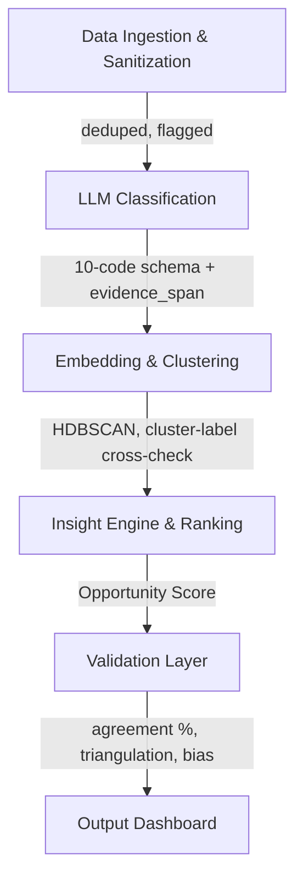

# LENS: AI-Powered Category-Discovery Insight Engine

LENS (Listening ENgine for Shoppers) is an AI-powered discovery engine built for the **Blinkit Growth Team** to analyze real user feedback at scale. Its purpose is to explain why users exhibit repetitive shopping behavior and to identify opportunities that encourage exploration of new categories (e.g., groceries buyers → pet supplies, snacks buyers → personal care).

**Scope discipline:** LENS finds and validates *barriers*. It does not propose solutions — that is Part 4. Keeping these separate ensures insights drive the solution, not the reverse.

---

## 🎯 Strategic Objective
* **Goal**: Increase the percentage of Monthly Active Customers (MAC) who purchase from at least one new category every month.
* **North Star Metric**: Category Adoption Rate (CAR) = % of MAC purchasing from ≥1 new category per month.
* **Solution**: Build LENS to ingest, classify, cluster, rank, validate, and display structured, evidence-backed insights — not generic summaries.

---

## 📊 Corpus (verified figures — do not restate from memory)

`SanitizedBlinkitReviews.xlsx` — **1,310 unique reviews** across 5 sources:

| Source | Count |
|---|---|
| Google Play Store | 500 |
| Apple App Store | 487 |
| YouTube comments | 277 |
| MouthShut | 41 |
| Trustpilot | 4 |
| Reddit | 1 |

**Sanitization actuals (from `sanitize_report.txt`):**
* Rows into sanitizer: 1,327 → duplicates removed: 17 → **1,310 unique**
* Low-signal rows (emoji-only / <10 letters): 55 — **flagged, not deleted** (`is_low_signal=True`)
* Usable rich reviews: 1,255

> ⚠️ **Historical note for accuracy:** an earlier raw export contained 5,000 rows that deduplicated to 1,033 unique. The current 1,310-row corpus is that set **plus 277 YouTube comments**, already merged and deduplicated. Do **not** state "5,000 → 1,310" or "~74% duplication" — those figures conflate two different runs and are not reproducible from the current file.

**Supporting dataset:** `Quick-Commerce_Insights_Survey.xlsx` — 20 structured survey responses. Used for **triangulation only** (not classified through the LLM pipeline). Key signals: 13/20 report buying the same products every time; top confidence-builders for trying something new are "reviews from shoppers like me" and "smaller/trial-size option."

**Known corpus biases (must be disclosed before any insight is presented):**
1. **Rating polarization** — 777 five-star vs 178 one-star, thin middle (32 three-star, 31 four-star, 15 two-star). Reviewers are the delighted or the furious; the ambivalent majority, where discovery decisions actually happen, is under-represented.
2. **Source skew** — 987 of 1,310 (75%) are app-store reviews, which over-index on delivery and refund complaints and under-index on category exploration.
3. **Missing ratings** — the 277 YouTube items have no star rating (NaN), so rating-based analysis covers only 1,033 items.
4. **Survivorship** — feedback comes only from people still using the app.
5. **Social-source thinness** — Reddit (1) and Trustpilot (4) are too small to support standalone claims; treat as anecdotal only.

These biases are precisely why Parts 2 and 3 (survey + primary interviews) exist — they cover the discovery signal reviews cannot.

---

## ⚙️ System Workflow



### 1. Data Ingestion & Sanitization — ✅ BUILT
* `sanitizeReviews.py`: collapses whitespace, strips stray/smart quotes, drops blanks, deduplicates on review text, derives `source_type` from URL, flags `is_low_signal`, assigns stable IDs (`R0001`…), emits `sanitize_report.txt`.
* `collectData.py`: social collector (Reddit public JSON + YouTube Data API v3 + manual Quora CSV).
  **Actual outcome:** YouTube returned 277 items (merged into the corpus). Reddit returned 1; Quora returned 0. The engine therefore relies on **5 sources with app-store dominance**, not a balanced social mix. State this honestly rather than claiming Reddit/Quora coverage.

### 2. LLM Classification — ✅ BUILT
* `classifyReviews.py` — Groq API, `llama-3.1-8b-instant`.
  **Model note:** originally specified as `llama-3.3-70b-versatile`; switched to the 8B model because of free-tier rate limits (HTTP 429). The 8B model is adequate for bounded schema classification but is weaker on nuanced Hinglish and borderline theme calls. **This makes the human-agreement audit (§5) more important, not less** — report the model used alongside the agreement score.
* **Hinglish handling:** there is **no separate translation step**. The classifier prompt instructs the model to interpret Hinglish directly. Describe it as *in-prompt interpretation*, not translation, so the architecture matches the code.
* **Resumability:** re-running skips IDs already present in `labeledReviews.jsonl`.
* **Outputs:** `labeledReviews.jsonl`, `themeSummary.csv`.

**Taxonomy — 10 substantive codes + 1 escape hatch (11 values total):**

| # | Code | Definition | Answers |
|---|---|---|---|
| 1 | `habit_loop` | Routine basket, mission-driven repetition | Q1, Q4 |
| 2 | `awareness_gap` | Didn't know a category/product exists on Blinkit | Q3 |
| 3 | `mental_model` | Narrow framing ("emergency only", "just groceries") | Q2 |
| 4 | `trust_quality` | Freshness, authenticity, expiry, wrong item/weight | Q6 |
| 5 | `trust_information` | Needs reviews/ratings/specs before trying | Q5 |
| 6 | `price_value` | Fees, markups, missing coupons, "cheaper elsewhere" | Q6 |
| 7 | `ux_friction` | Search, navigation, discovery UI, cart | Q3, Q6 |
| 8 | `assortment_gap` | Desired category/SKU not stocked | Q8 |
| 9 | `delivery_ops` | Speed, driver, refunds, support — **the loud majority** | context |
| 10 | `emotional` | Impulse, anxiety, delight, guilt, FOMO | Q2 |
| — | `other` | Low-signal/emoji, or genuine signal outside the spine | — |

*Escape-hatch rule:* a recurring pattern inside `other` is promoted to a real code only if it appears ≥15 times. This preserves inductive discovery without letting the model invent themes freely.

**Fields extracted per review:** primary/secondary theme, sentiment, intent, `categories_mentioned`, `explores_new_category` (bool), `barrier_to_exploration`, `info_needed_before_trying`, JTBD statement, `segment_signal`, `confidence`, and an exact-substring `evidence_span` (the anti-hallucination anchor).

### 3. Embedding & Clustering — 🔲 PLANNED (not yet built)
* Generate embeddings per review; cluster semantically with HDBSCAN.
* **Cross-check clusters against LLM theme labels** — agreement between two independent methods is convergent validity; a theme scattered across many clusters is flagged as fuzzy.

### 4. Insight Engine & Opportunity Ranking — 🔲 PLANNED
* One insight card per cluster: finding, "so-what" for new-category adoption, 3 real quotes with source URLs, affected segments, counter-evidence, confidence, and a `validation_needed` hook.
* **Opportunity = Frequency × Severity × Addressability × Strategic Fit**
  *Why ranking, not raw frequency:* `delivery_ops` will dominate by volume but is low-addressability and low strategic fit for category adoption. Ranking is what makes an information/trust barrier correctly outrank a delivery complaint. **`delivery_ops` is context, not the answer — quarantine it.**

### 5. Validation Layer — 🔲 PLANNED (highest-scoring component; do not skip)
1. **Human agreement** — hand-label 50 random reviews against the same taxonomy; report agreement % (target ≥85%) plus a confusion table showing which theme boundaries are weak.
2. **Cluster–label convergence** — see §3.
3. **Source triangulation** — an insight is high-confidence only if present in ≥2 source types; single-source insights are "directional."
4. **Confidence + assumption marking** — every insight tagged High/Medium/Low; unproven leaps tagged `[ASSUMPTION]`; gaps tagged `[VALIDATE]` with a matching interview question.
5. **Bias disclosure** — state the five biases above before presenting insights.

> ⚠️ No agreement figure exists until the audit is run. Do not hardcode a placeholder (e.g. "87.5%") into any doc, dashboard, or slide — a fabricated validation number is the single most damaging thing in a research deliverable.

### 6. Output Dashboard — 🔲 PLANNED
* Streamlit app rendering ranked insights: frequency, affected segments, confidence, representative quotes with URLs, and the "so-what" implication — each tagged with which of Q1–Q8 it answers.
* This public URL is the graded **"link to test out your workflow"** deliverable.

---

## ❓ The 8 Core Research Questions
1. Why do users repeatedly buy from the same categories?
2. What prevents users from exploring new categories?
3. How do users discover products today?
4. What role do habits play in shopping behavior?
5. What information do users need before trying a new category?
6. What frustrations emerge repeatedly?
7. Which user segments are more likely to experiment?
8. What unmet needs emerge consistently across discussions?

Every insight must be tagged with the question(s) it answers. **Any question the data cannot answer must be named as a gap and routed to primary research — never answered by inference.**

---

## 🚧 Guardrails (enforce in agent instructions and code review)
* **No fabrication.** Every label carries an exact-substring `evidence_span`; every insight carries real quotes with source URLs. Thin evidence → confidence = low. Never invent a quote, a statistic, or a validation score.
* **Fixed theme spine.** No new top-level themes except via the `other` → ≥15× promotion rule.
* **Quarantine the loud majority.** Rank by strategic fit to new-category adoption, not raw volume.
* **Reproducibility.** Every figure in any document must be regenerable from a committed script's output (`sanitize_report.txt`, `themeSummary.csv`, the audit sheet). If it can't be regenerated, it doesn't go in.
* **No solutioning in Part 1.**

---

## ✅ Acceptance Criteria (definition of done for Part 1)
- [ ] Sanitize → classify → cluster → rank → validate runs end-to-end and is demonstrable via one public link
- [ ] ≥85% human–LLM agreement on the 50-item audit (reported with the model name)
- [ ] ≥3 insights triangulated across ≥2 source types
- [ ] Every insight carries a confidence level, a Q1–Q8 tag, and (if <High) a validation question
- [ ] `delivery_ops` does not crowd out discovery insights in the final ranking
- [ ] All four required demonstrations present: how data is gathered · how themes are identified · how insights are generated · how quality was validated

---

## 📦 Deliverables (per the brief)
1. **Public workflow link** — the dashboard, testable by an evaluator
2. **1-slider** in the deck covering the four demonstrations above
3. **Findings Report** — theme distribution, ranked insights, validation results, bias disclosure *(a separate document from this one: this file is the blueprint, the Findings Report is the results)*
4. **Appendix artifacts** — `labeledReviews.jsonl`, `themeSummary.csv`, `sanitize_report.txt`, the 50-item audit sheet

---

## 📂 Project Structure

```
GradProject_Blinkit_P1/
├── collectData.py                  # ✅ social collector (YouTube worked; Reddit/Quora did not)
├── sanitizeReviews.py              # ✅ clean + dedup + flag → SanitizedBlinkitReviews.xlsx
├── classifyReviews.py              # ✅ Groq llama-3.1-8b-instant → labeledReviews.jsonl
├── clusterInsights.py              # 🔲 embeddings + HDBSCAN + insight synthesis
├── validateInsights.py             # 🔲 50-item audit, triangulation, confidence
├── dashboard.py                    # 🔲 Streamlit UI (the public deliverable)
├── data/
│   ├── Blinkit_Reviews.xlsx                    # raw
│   ├── SanitizedBlinkitReviews.xlsx            # 1,310 unique — classifier input
│   ├── Quick-Commerce_Insights_Survey.xlsx     # n=20, triangulation
│   ├── social_data.xlsx                        # collector output
│   ├── labeledReviews.jsonl                    # classifier output
│   ├── themeSummary.csv
│   └── sanitize_report.txt
└── docs/
    ├── context.md                  # this file (blueprint)
    ├── architecture.md
    ├── problemStatement.md
    ├── findingsReport.md           # 🔲 written after classification
    ├── edgeCase.md
    └── implementationPlan.md
```

---

## ⚠️ Known Failure Cases to Document
* Sarcasm and irony in Hinglish misread as sincere sentiment
* Delivery-partner (rider) complaints misclassified as customer trust issues
* Review bombing after price/fee changes inflating `price_value`
* Near-duplicate reviews across app versions surviving exact-match dedup
* Low-signal rows (55) forced into a theme instead of `other` — check these in the audit